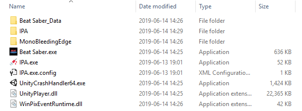

# Installing BSIPA

> [!NOTE]
> This guide assumes that you are starting completely fresh.

 1. Grab a release from the GitHub [Releases page](https://github.com/beat-saber-modding-group/BeatSaber-IPA-Reloaded/releases).
    Make sure to download one of the `BSIPA-*.zip`s, as `ModList.zip` contains the Beat Saber mod for showing your mods in-game, not the loader itself.

    > [!NOTE]
    > The specific ZIP you need to download varies on the game you will be patching. For example, if you are patching Beat Saber, you will need the file
    > `BSIPA-x64-Net4.zip`. This is because Beat Saber is a 64 bit game running .NET 4. If you are patching Muse Dash, however, you nee the file
    > `BSIPA-x86-Net3.zip`.
    >
    > [!TIP]
    > There are a few tricks for figuring out which file you need. If the game has a folder called `MonoBleedingEdge` in the install directory, then you
    > need one of the `Net4` builds. To determine *which* build to use, right click on the game executable, go to the `Compatability` tab, check the
    > `Run this program in compatability mode for` checkbox, and look and see if the dropdown has any Windows XP emulation options. If it does, the
    > application is 32 bit, and you need to get one of the x86 builds. Otherwise, get one of the x64 builds.
    >
    > Make sure to uncheck that checkbox before leaving the menu.

 2. Extract the zip into your game installation directory. There should now be a folder named `IPA` and a file named `IPA.exe` in
    the same folder as the game executable.

    For example, if you are installing BSIPA in Beat Saber, it might look like this after extraction:

    

 3. Run `IPA.exe` by double clicking it. A console window should pop up, and eventually, a gold message asking you to press a key
    will appear. Here is an example of a successful installation:

    

    > [!NOTE]
    > In some cases, this may fail, something like this: 
    >
    > In these cases, try dragging the game executable over `IPA.exe`.

    After installing, your game directory should look something like this:
    

    > [!NOTE]
    > At this point it is recommended to run the game once before continuing, to ensure that things are installed correctly.
    >
    > The first run should create a `UserData` folder with `Beat Saber IPA.json` and `Disabled Mods.json`, as well as a
    > `Logs` folder with several subfolders with their own files. If these are created, then the installation was very
    > likely successful.
    >
    > [!TIP]
    > If you are not installing BSIPA on Beat Saber, you probably want to go to the config at `UserData/Beat Saber IPA.json`
    > and set both of the following to `false`:
    >
    > ```json
    > {
    >   ...
    >   "Updates": {
    >     "AutoUpdate": false,
    >     "AutoCheckUpdates": false
    >   },
    >   ...
    > }
    > ```
    >
    > [!TIP]
    > Depending on the game, you may have to set the config member `GameAssemblies` to the names of the assemblies
    > that the game uses for BSIPA to virtualize them properly.
    >
    > For Beat Saber distrobutions, this will be set according to the version that it was built for by default.
    > Otherwise, it will contain just `Assembly-CSharp.dll` since most games use that default.

 4. From here, just place all of your plugins in the `Plugins` folder, and you're all set!

    Many plugins will come in a zip such that the root of the zip represents the game install directory, so all you may have to
    do is extract the plugin into the game installation folder.

> [!NOTE]
>
> For some reason, by default, Wine does not load DLLs in quite the same way that Windows does, causing issues with the injection.
> To make the injection work with Wine, `winhttp` has to have a DLL override set to `native,builtin`. This can be set either through
> Protontricks, or with the following `.reg` file.
>
> ```reg
> REGEDIT4
> [HKEY_CURRENT_USER\Software\Wine\DllOverrides]
> "winhttp"="native,builtin"
> ```
>
> For Steam there's a per-game Wine prefix under `compatdata`. In this case `SteamLibrary/steamapps/compatdata/620980/pfx/user.reg`.
> Changes to this file will likely be ovewritten when the game updates or if local files are validated through Steam.

Thats really all you have to do! The installation should persist across game updates for as long as `winhttp.dll` is present in
the game directory, though your plugins will be moved to a different folder when it does update so things don't break horribly.

## Uninstalling

Uninstalling is fairly simple, and can be done one of two ways:

1. Drag the game executable over `IPA.exe` while holding <kbd>Alt</kbd>.
2. Open a command prompt or Powershell terminal and run `.\IPA.exe -rn`. (see <xref:articles.command_line> for what those options mean)
